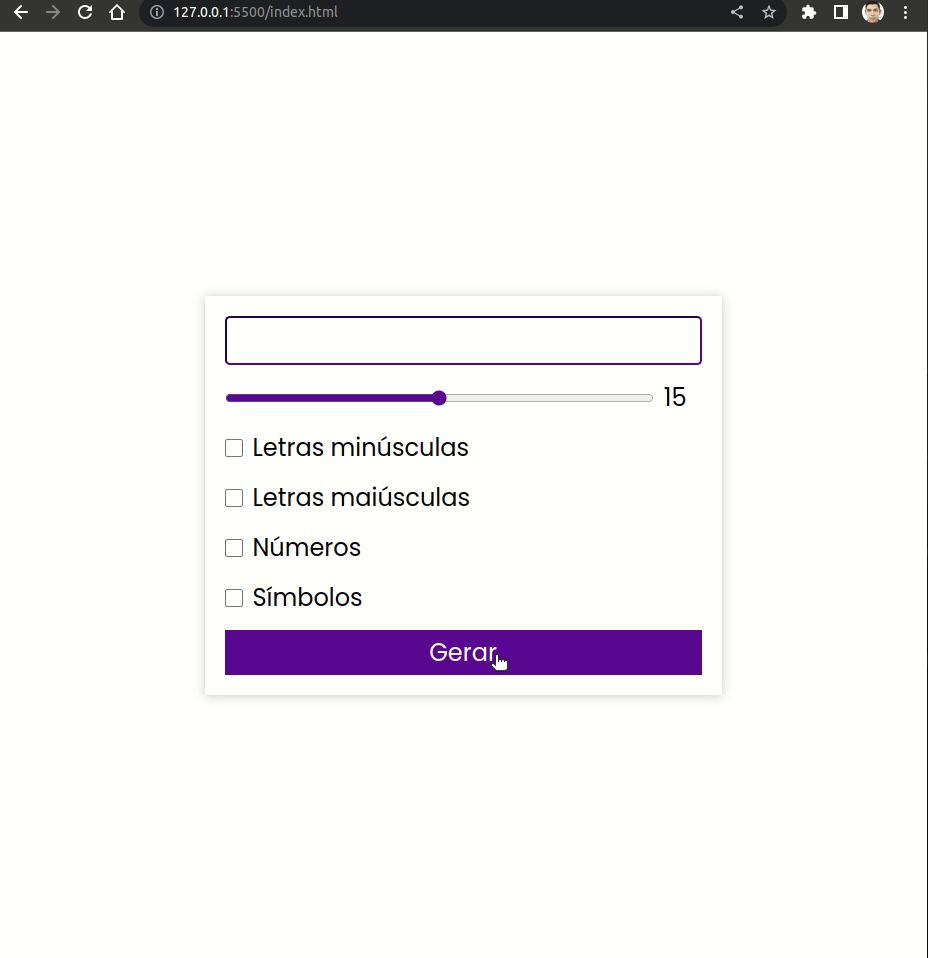

<h1 style="text-align: center; font-weight: bold;">Chat - Websocket</h1>

## Demo 📸

<div align="center" >
  
</div>

---

## Sobre o Projeto

O Projeto foi desenvolvido durante minha semana de estudos para aprimorar meus conhecimentos em Desenvolvimento Web(HTML, CSS e JS).

### 🛠 Tecnologias

As seguintes ferramentas foram usadas na construção do projeto:

- [HTML]()
- [CSS]()
- [JAVASCRIPT]()

---

### 🎲 Rodando o App Web

```bash
# Clone este repositório
$ git clone https://github.com/leandrosuy/gerador-de-senha
```

<a href="https://raw.githubusercontent.com/ARTHURPC03/Proffy-FullStack/master/github/linkedin.png">
</a>
<br />

Veja meu Linkedin: [Leandro Dantas](https://www.linkedin.com/in/leandro-dantas-1959b711b/)
